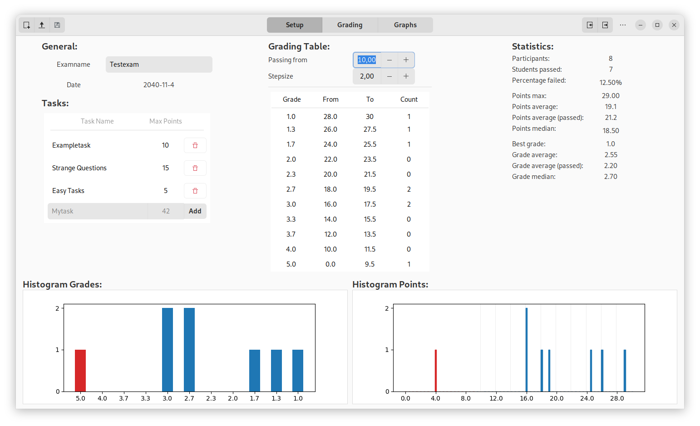
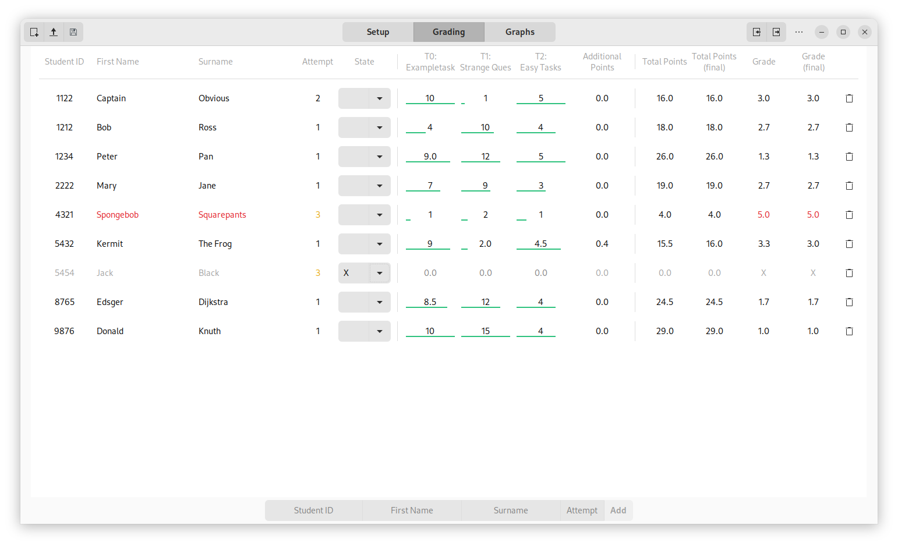
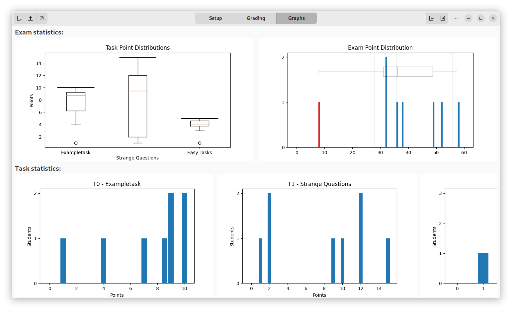

# Exam Grader

This is a tool for grading exams. You can use it to enter the points of the exam participants, modify the grade limits and export the results as CSV for upload to campus management systems (e.g. Moodle).

## Setup

### Python on Linux

Optional: Use a _python venv_:

```bash
sudo apt install python3-venv  # if not installed already
python -m venv .env
source .env/bin/activate
```

#### Install all dependencies:

- Ubuntu:

```bash
sudo apt install python3-pip libgirepository1.0-dev
```

- Fedora:

```bash
sudo dnf install cairo-gobject-devel
```

#### Installation

Regular:
```bash
# in the projects root folder:
pip install .
```

Development installation:
```bash
# Prepare the .gresource file
glib-compile-resources --target=ui.gresource resources.xml
# in the projects root folder:
pip install -e .
```

#### Execution

Run it:
```bash
exam-grader
```

### Windows

The following programs need to be installed:

- Imagemagick: https://imagemagick.org/script/download.php#windows
- Ghostscript: https://www.ghostscript.com/download/gsdnld.html

You can then download the exe file [here](https://git.rwth-aachen.de/acs/public/exam-tools/exam_scan_manager/-/jobs/artifacts/ci/download?job=win-build).
Extract the archive and double-click the `exam-scan-manager.exe`.

#### Development build on Windows

You need to install [MSYS2](https://www.msys2.org/).
Please execute the `pacman` and `pip` installation instructions from the [CI File](.gitlab-ci.yml) in the _mingw64_ shell.
You should then be able to execute the python files from that shell as well.

Background information can be found [here](https://www.kb.cert.org/vuls/id/332928/)

## Gallery






## License

This tool is licensed under the [GPLv3](LICENSE).
Libraries contained in the Windows package are unmodified and are licensed under their respective license.
